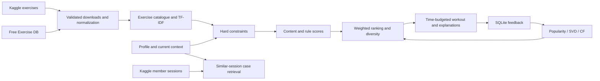

# Gym Workout Recommendation System

The three-slide proposal specifies four goals (Beginner, Weight Loss, Muscle Gain, Strength), user profiles, exercise attributes and activity history. This application implements that workflow as a local Streamlit application with SQLite persistence. It does not introduce camera recognition: the presentation has no image detection or pose-estimation requirement, so Roboflow annotations are not needed.

## Architecture

## Data contract

- Profile: UserID, age, gender, height in cm, weight in kg, computed BMI, goal, experience, available equipment, focus/excluded primary muscles, minutes, location and energy.
- Exercise: stable normalized-title ID, name, description, category, primary muscle, level, source equipment, inferred required equipment, source rating, instructions and instruction provenance.
- Activity: generated activity ID, profile foreign key, exercise ID, actual duration in minutes, completion in [0,1], explicit 1–5 rating and UTC timestamp. One row is one logged exercise, not a whole workout session.
- Proposal calories field: downloaded session-level Calories_Burned is visible in case retrieval. Exercise-level calories are unavailable and deliberately remain unestimated. Source-session calories cannot be assigned to unrelated catalogue exercises.

Raw data remains unchanged. Deduplication uses normalized exercise titles and keeps the first occurrence. Equipment accessories are inferred from description/name tokens and may conservatively exclude exercises. Unknown/other source equipment cannot be selected. Source secondary muscles and medical contraindications are not modeled.

## Ranking

1. Reject items above experience level, beyond available equipment or in excluded/focus-mismatched primary muscle groups. Beginner goal and low energy cap difficulty at beginner. Outdoors removes fixed machines and cable equipment from availability; home uses explicitly selected home equipment.
2. Content cosine compares goal/focus TF-IDF to exercises. When positive feedback exists, blend 60% profile similarity and 40% liked-exercise centroid similarity.
3. Popularity is (5 × source-prior + local-count × local-mean) / (5 + local-count), with ratings normalized to [0,1]. Missing source ratings use the catalogue median. Raw source ratings contain zeros and lack vote counts; they are not clinical quality labels.
4. Knowledge score = 0.7 category-goal match + 0.3 experience match. Context score = 0.6 knowledge + 0.4 personal historical completion, defaulting to 0.5 completion when unobserved.
5. Hybrid = 0.40 content + 0.20 popularity + 0.25 knowledge + 0.15 context. With feedback support, blend 80% hybrid and 20% mean of SVD/user CF/item CF. Weights are engineering defaults, not learned or validated optimal values.
6. CF uses averaged repeated ratings. Require at least two users and two rated exercises for the active user. User/item cosine is shrunk by overlap/(overlap+3). SVD subtracts user means, imputes missing residuals as zero, retains up to eight factors, restores means and clips to [1,5]. Unsupported items receive zero collaborative scores. Sparse overlap can still produce weak signals; more genuine ratings are needed.
7. Greedy selection subtracts 0.10 per already-selected exercise with the same primary muscle. The plan assigns 5-minute blocks for low energy and 7 otherwise, shortening the block to fit a 10-minute session, plus a 5-minute preparation buffer. It never exceeds the user's budget. Templates are illustrative planning allocations and not exercise prescriptions.

## Evaluation and limitations

`evaluate.py` performs real-catalogue constraint checks and reports coverage/diversity. If genuine local histories contain sufficient unseen held-out positive items, it additionally computes chronological leave-last-positive-out Recall@10, NDCG@10 and hit rate for each method. It trains on the pre-cutoff global history only, avoiding future feedback leakage. Missing accuracy evidence is reported as unavailable, not replaced by synthetic fitness claims. Tests use small synthetic ratings solely as deterministic fixtures.

This is a local educational prototype, not a validated coaching or medical system. No health outcomes are inferred from demographics or BMI. It has no authentication or deployment hardening and binds only to localhost. Profiles persist unencrypted in the project database, are not uploaded and should use aliases. The app downloads no runtime images and works offline once dependencies/data are installed. Dataset origin does not establish clinical validity or that member sessions are longitudinal real-person measurements.
